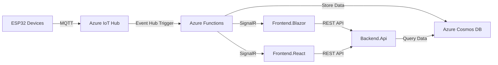

# MyWatering - IoT Watering System

> **⚠️ Early Development Stage**: This project is in its early stages with ongoing improvements and feature additions.

## Overview

MyWatering is a comprehensive IoT-based watering and environmental monitoring system built on Azure cloud infrastructure. The system enables dynamic sensor configuration, real-time data collection from ESP32-based devices, cloud storage, and visualization through modern web frontends.

## Architecture

### System Components



### Backend

- **Backend.Api**: ASP.NET Core REST API for device data retrieval
- **Backend.Functions**: Azure Functions for IoT Hub event processing and SignalR broadcasting
- **Backend.Lib**: Shared library containing models and storage interfaces

### Frontend

- **Frontend.Blazor**: Blazor WebAssembly dashboard (primary)
- **Frontend.React**: React + Vite dashboard (in development)
- **Frontend**: Legacy HTML/JavaScript frontend

### Device Support

Currently supported microcontrollers:
- ESP32-DevKit
- D1 Mini 32
- ESP32-Dev

**Planned**: ESP-01 support

## Key Features

### Dynamic Sensor Configuration

The framework allows flexible sensor configuration where you can:
- Define which GPIO pins connect to which sensor types
- Support multiple sensor types (moisture, temperature, humidity, battery, etc.)
- Read values dynamically based on configuration
- Send telemetry data to Azure IoT Hub

### Mesh Networking (Planned)

- Sensors can connect via mesh network
- Nodes pass data to a Gateway device
- Gateway forwards aggregated data to Azure cloud

### Cloud Infrastructure

- **Azure IoT Hub**: Device-to-cloud messaging
- **Azure Functions**: Event-driven data processing with EventHub triggers
- **Azure Cosmos DB**: NoSQL storage for time-series and latest device data
- **Azure SignalR Service**: Real-time updates to web clients
- **Application Insights**: Telemetry and monitoring

### Web Dashboards

Both frontends provide:
- Real-time device status monitoring
- Sensor value visualization
- Device card views with moisture, battery, and connectivity status
- Responsive design with Tailwind CSS

## Roadmap

### In Progress
- ✅ Azure Functions integration
- ✅ Cosmos DB storage
- ✅ Blazor frontend
- 🔄 React frontend
- 🔄 Real-time chart visualization

### Planned Features

#### Automation & Thresholds
- Set threshold values for each sensor
- Automated actions based on sensor readings:
  - **Low moisture** → Activate water pump
  - **High/Low temperature** → Control fan/heater
  - **Custom rules** → User-defined automation

#### Mesh Gateway
- Implement mesh network topology
- Gateway node aggregation
- Multi-hop sensor data routing

#### Additional Sensors
- Expand sensor type support
- Calibration interfaces
- Historical trend analysis

## Project Structure

```
src/
├── Backend.Api/              # REST API for frontend
├── Backend.Functions/        # Azure Functions (IoT Hub triggers)
├── Backend.Lib/              # Shared models and storage
├── Frontend.Blazor/          # Blazor WebAssembly app
├── Frontend.React/           # React + Vite app
└── Frontend/                 # Legacy HTML frontend
```

## Getting Started

### Prerequisites

- .NET 9.0 SDK
- Node.js (for React frontend)
- Azure subscription
- Azure IoT Hub instance
- Azure Cosmos DB account

### Configuration

1. **Backend.Api**: Update `appsettings.json` with your Cosmos DB connection string
2. **Backend.Functions**: 
   - Update `local.settings.json` for local development
   - Configure Application Settings in Azure Portal for production
   - Required settings:
     - `AzureWebJobsStorage`
     - `IoTHubConnectionString`
     - `CosmosConnectionString`
     - `APPLICATIONINSIGHTS_CONNECTION_STRING`

### Running Locally

#### Backend API
```bash
cd src/Backend.Api
dotnet run
```

#### Azure Functions
```bash
cd src/Backend.Functions
func start
```

#### Blazor Frontend
```bash
cd src/Frontend.Blazor
dotnet run
```

#### React Frontend
```bash
cd src/Frontend.React
npm install
npm run dev
```

## Technology Stack

- **Backend**: .NET 9.0, Azure Functions (Isolated Worker)
- **Frontend**: Blazor WebAssembly, React 19, Vite
- **Styling**: Tailwind CSS
- **Cloud**: Azure IoT Hub, Azure Functions, Cosmos DB, SignalR Service
- **Devices**: ESP32 (Arduino/PlatformIO)

## Contributing

This project is in early development. Contributions, suggestions, and feedback are welcome!


